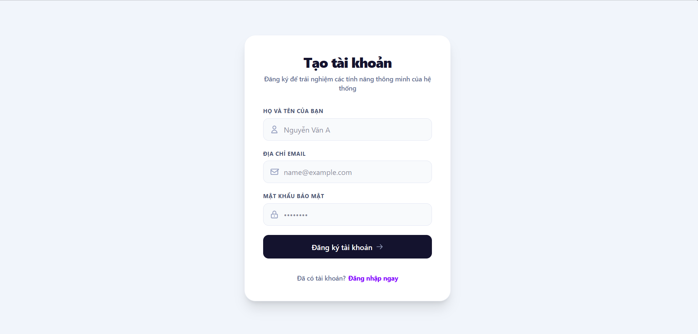
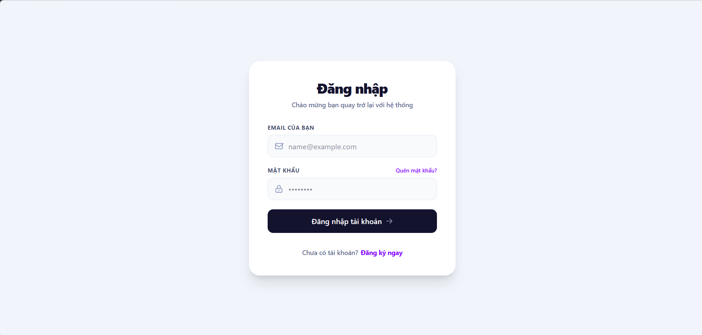
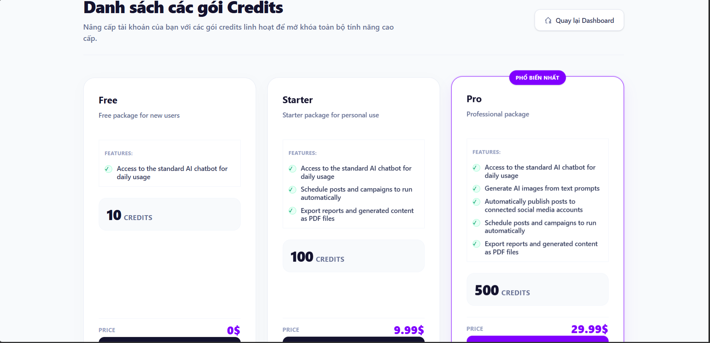
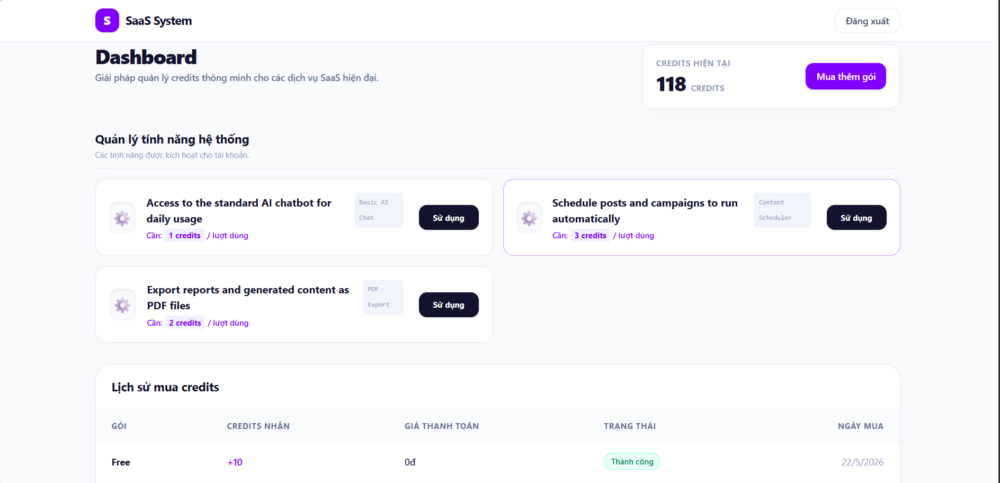
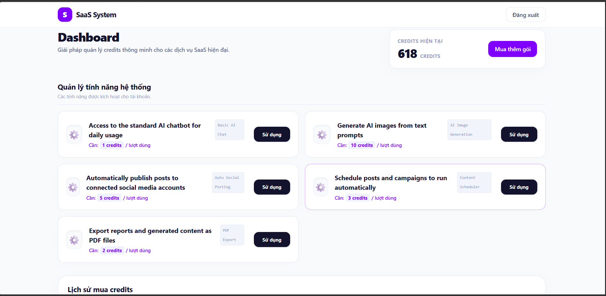
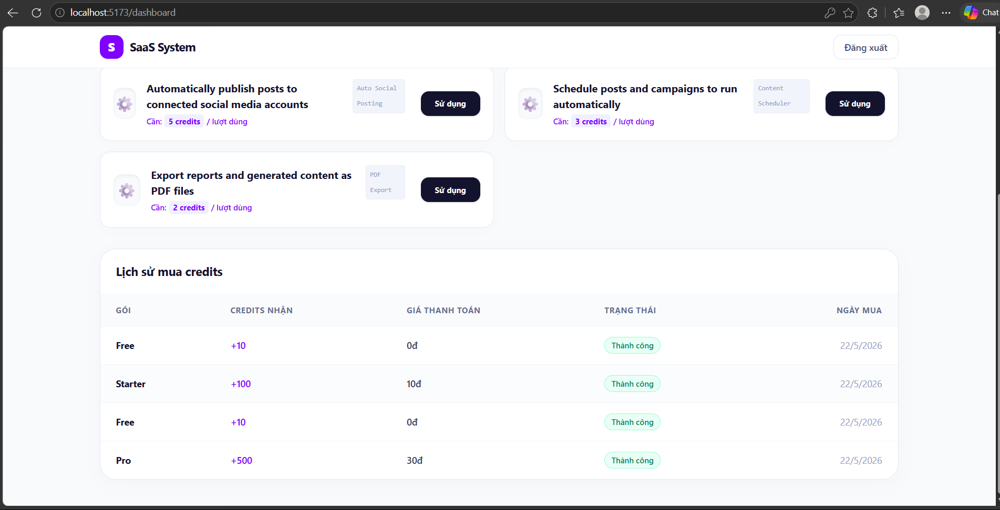

# SaaS Credit System

Hệ thống bán gói credits cho website SaaS — cho phép user mua gói, nhận credits và sử dụng các tính năng tương ứng với gói đã mua.

## Tech Stack

| Layer | Công nghệ |
|---|---|
| Backend | Python 3.11 · FastAPI · SQLAlchemy |
| Frontend | ReactJS · Vite · Tailwind CSS |
| Database | PostgreSQL 16 |
| Containerization | Docker · Docker Compose |

---

## Yêu cầu

- [Docker Desktop](https://www.docker.com/products/docker-desktop/) đã cài và đang chạy

---

## Chạy project

### 1. Clone repository

```bash
git clone https://github.com/Trannganne/saas-credit-system.git
cd saas-credit-system
```

### 2. Tạo file `.env`

Tạo file `.env` ở thư mục gốc (cùng cấp với `docker-compose.yml`) với nội dung sau:

```env
DATABASE_URL=postgresql://postgres:123456@db:5432/saas_credit_system
SECRET_KEY=changeme
ALGORITHM=HS256
ACCESS_TOKEN_EXPIRE_MINUTES=30
```

### 3. Khởi động toàn bộ hệ thống

```bash
docker-compose up --build
```

### 4. Truy cập

| Service | URL |
|---|---|
| Frontend | http://localhost:5173 |
| Backend API | http://localhost:8000 |
| API Docs (Swagger) | http://localhost:8000/docs |

---

## Dữ liệu mẫu ( thuận tiện cho nhà tuyển dụng test)

Khi backend khởi động lần đầu, hệ thống **tự động seed** dữ liệu gồm:

**4 gói credits:**

| Gói | Credits | Giá | Tính năng |
|---|---|---|---|
| Free | 10 | 0$ | Basic AI Chat |
| Starter | 100 | 9.99$ | Basic AI Chat · PDF Export · Content Scheduler |
| Pro | 500 | 29.99$ | AI Image Generation · Auto Social Posting |
| Enterprise | 5000 | 99.99$ | Developer API Access |

**10 tính năng:** Basic AI Chat, AI Image Generation, Auto Social Posting, Content Scheduler, PDF Export, Email Campaign, Advanced Analytics, Developer API Access, Team Workspace, Priority Support.

---

## Hướng dẫn sử dụng

1. Truy cập http://localhost:5173
2. **Đăng ký** tài khoản mới tại `/register`
3. **Đăng nhập** tại `/login`
4. Vào trang **Packages** để xem và mua gói credits
5. Sau khi mua, vào **Dashboard** để xem số dư credits, lịch sử giao dịch và các tính năng đã unlock

> Thanh toán được **giả lập** — không tích hợp cổng thanh toán thật, mọi giao dịch đều thành công ngay lập tức.

---

## Cấu trúc project

```
saas-credit-system/
├── backend/
│   ├── app/
│   │   ├── core/          # Config, security (JWT)
│   │   ├── models/        # SQLAlchemy models
│   │   ├── routers/       # API endpoints
│   │   ├── schemas/       # Pydantic schemas
│   │   ├── dependencies/  # Auth & feature check middleware
│   │   ├── seeds/         # Dữ liệu mẫu tự động seed
│   │   ├── database.py
│   │   └── main.py
│   ├── Dockerfile
│   └── requirements.txt
├── frontend/
│   ├── src/
│   │   ├── pages/         # Login, Register, Dashboard, Packages
│   │   ├── api/           # Axios instance
│   │   └── context/       # Auth context
│   ├── Dockerfile
│   └── package.json
├── docker-compose.yml
└── .env
```

---

## API chính

| Method | Endpoint | Mô tả | Auth |
|---|---|---|---|
| POST | `/auth/register` | Đăng ký tài khoản | Không |
| POST | `/auth/login` | Đăng nhập, nhận JWT token | Không |
| GET | `/packages` | Danh sách gói credits | Không |
| GET | `/packages/{id}/features` | Tính năng của một gói | Không |
| POST | `/purchase/` | Mua gói credits | Có |
| GET | `/users/me/credits` | Xem số dư credits | Có |
| GET | `/users/me/transactions` | Lịch sử giao dịch | Có |
| GET | `/users/me/features` | Tính năng đã unlock | Có |
| POST | `/tools/{feature_name}` | Sử dụng tính năng | Có |

Xem đầy đủ tại http://localhost:8000/docs

---

## Dừng project

```bash
# Dừng nhưng giữ nguyên data
docker-compose down

# Dừng và xóa toàn bộ data (reset database)
docker-compose down -v
```

## Screenshots






